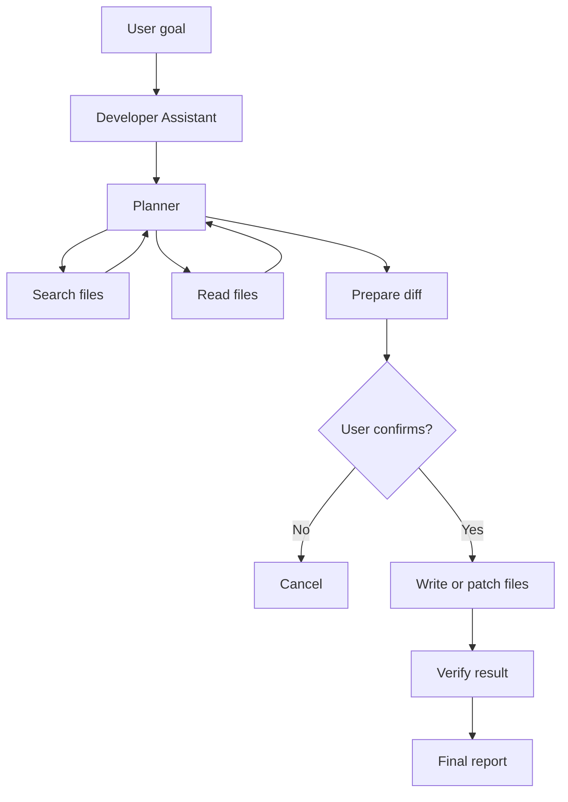
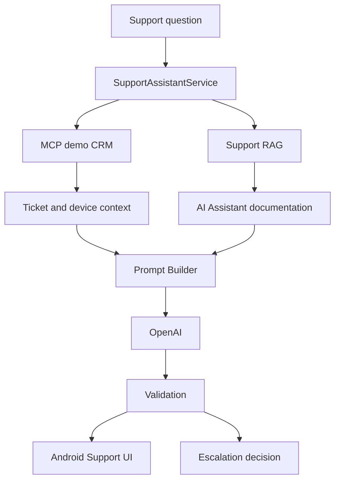

# AI Assistant

## Day 31 — Developer Assistant CLI

Добавлен отдельный Kotlin/JVM-инструмент `developer-assistant`: локальные embeddings и RAG-индекс строятся через Ollama `nomic-embed-text:latest`, ответ `/help` генерируется через OpenAI Responses API (`gpt-4.1-mini`), а Git-ветка получается через MCP. Инструмент не зависит от Android SDK и не входит в APK.

Запуск: `gradlew.bat :developer-assistant:run --args="--project-root=."`. Подробнее: [developer-assistant/README.md](developer-assistant/README.md).

## Day 34 — Project File Assistant

Терминальный `developer-assistant` расширен агентным режимом работы с файлами проекта. Пользователь вводит цель обычным языком, а ограниченный цикл (не более 10 tool-итераций) сам просматривает дерево, выполняет точный поиск, читает актуальные файлы, готовит изменение в памяти и показывает diff. Существующие `/help` с RAG, PR review Day 32 и индекс поддержки Day 33 сохранены.



Доступные локальные tools: `list_files`, `search_in_files`, `read_file`, `write_file`, `apply_patch`, `get_diff`. RAG используется для существующих вопросов и предварительного отбора контекста; перед изменением содержимое всегда читается с диска. Proposed changes не затрагивают рабочее дерево до ответа `y` или `yes`; любое другое значение отменяет запись. `--dry-run` выполняет анализ и показывает diff, но никогда не пишет файлы.

```powershell
# Интерактивный запуск
.\gradlew.bat :developer-assistant:run --args="--project-root=."

# Без записи
.\gradlew.bat :developer-assistant:run --args="--project-root=. --dry-run"
```

Перед запуском задайте `OPENAI_API_KEY` и запустите Ollama, как описано в [developer-assistant/README.md](developer-assistant/README.md). Индекс строится инкрементально при запуске; `/reindex` выполняет принудительную полную переиндексацию. После записи ассистент явно предлагает переиндексировать изменённые файлы. Команды интерактивного режима: `/help <question>`, `/status`, `/reindex`, `/diff`, `/exit`.

Демонстрационные цели:

- `Найди все места, где используется SupportAssistantService, и создай отчёт.` — создаёт `docs/generated/support-assistant-usage.md`.
- `Проверь реализацию поддержки и обнови документацию, чтобы она соответствовала коду.` — идемпотентно обновляет помеченный раздел README.
- `Проверь инварианты CRM и MCP и создай отчёт.` — создаёт `reports/day-34-project-validation.md`.

Пример предварительного diff начинается с `diff --git a/... b/...`, содержит `---`, `+++`, удалённые строки с `-` и добавленные с `+`. Повторный запуск сравнивает итоговое содержимое: одинаковый файл не записывается, а управляемый раздел README заменяется, поэтому дубликаты не накапливаются.

Безопасность: нормализованный путь обязан оставаться внутри абсолютного project root; внешние symlink, служебные каталоги, бинарные/слишком большие файлы и `.env*`, `local.properties`, keystore и credential JSON запрещены. Запись выполняется через временный файл и atomic move, patch требует единственного точного совпадения. Git commit/push/reset/clean и смена веток не выполняются. Журнал последней операции без содержимого файлов и ключей сохраняется в `developer-assistant/logs/last-operation.json`.

Ограничения: агент извлекает известный API или компонент из естественной формулировки цели либо из имени в обратных кавычках; полностью произвольное рефакторинг-планирование пока не поддерживается. Локальный unified diff показывает изменённую область с тремя строками контекста. Один запуск обрабатывает не более 10 tool calls.

## Day 29 — Local LLM Optimization

В режиме `Local` параметры Ollama меняются прямо в Settings и автоматически
применяются к следующему обычному или RAG-запросу: Model, Temperature,
Max output tokens, Context window, Top P, Repeat penalty, Seed и System prompt.

- Temperature управляет предсказуемостью и разнообразием.
- Max output tokens ограничивает длину ответа.
- Context window задаёт объём учитываемого контекста и расход памяти.
- Top P ограничивает набор вероятных токенов.
- Repeat penalty уменьшает повторы.
- Seed помогает повторять результаты.

Для сравнения качества фиксируйте seed и меняйте по одному параметру. Скорость
смотрите под локальным ответом в `tok/sec`; нажатие на метрики открывает детали
времени загрузки, генерации и количества токенов.

Установка и проверка моделей:

```bash
ollama pull qwen2.5:7b-instruct-q4_K_M
ollama pull qwen2.5:7b-instruct-q5_K_M
ollama list
ollama ps
ollama show qwen2.5:7b-instruct
```

Для эксперимента Q4_K_M и Q5_K_M отправляйте один и тот же prompt и сохраняйте
одинаковыми `temperature`, `max output tokens`, `context window`, `top_p` и
`repeat_penalty`. Q4_K_M обычно требует меньше памяти и работает быстрее;
Q5_K_M требует больше памяти и может дать более качественный результат, но это
не гарантируется и зависит от конкретного запроса.

Если выбранной модели нет, приложение не скачивает её автоматически: выполните
`ollama pull <model>` вручную.

> OpenRouter использует имена моделей вида `openai/gpt-4o-mini`, а прямой
> OpenAI API использует только имя модели без префикса, например `gpt-4.1-mini`.

Модульное Android-приложение на Kotlin и Jetpack Compose с двумя режимами LLM:

- `Online` — прямой OpenAI Responses API (`https://api.openai.com/v1/responses`);
- `Local` — Ollama (`http://10.0.2.2:11434`, модель по умолчанию `qwen2.5:7b-instruct`).

Приложение использует Clean Architecture, MVVM, Dagger 2, Retrofit/OkHttp, Room,
DataStore и локальный RAG. Один и тот же локальный retrieval-контекст передаётся
выбранному online или local генератору.

## Настройка OpenAI

1. Создайте API key в OpenAI Platform.
2. Подключите отдельный API billing (подписка ChatGPT не включает API billing).
3. Добавьте в корневой `local.properties` строку без кавычек:

```properties
OPENAI_API_KEY=your_openai_api_key
```

4. Синхронизируйте Gradle и пересоберите приложение.
5. В Settings выберите `Online`; при необходимости измените модель
   `gpt-4.1-mini`.
6. Выполните тестовый запрос.

`local.properties` не коммитится и указан в `.gitignore`. Если ключ отсутствует,
приложение покажет инструкцию и не отправит запрос с пустым Bearer-заголовком.

> Для учебного проекта ключ передаётся в `BuildConfig` и попадает в APK.
> Это нельзя использовать в опубликованном production-приложении.

## Локальный режим

Установите Ollama и загрузите модель:

```bash
ollama pull qwen2.5:7b-instruct
```

Android Emulator обращается к Ollama хоста по `http://10.0.2.2:11434`.
На физическом устройстве задайте IP компьютера в Settings.

## Проверка

Windows:

```powershell
.\gradlew.bat testDebugUnitTest
.\gradlew.bat assembleDebug
```

## Day 30 — Private LLM Service

The application has three independent backends: **OpenAI**, **Local Ollama**, and
**Private VPS**. The private path is:

`Android AI Assistant → HTTP API → Nginx → Open WebUI → Ollama → Qwen 2.5 3B`

Add development defaults to the untracked root `local.properties` file:

```properties
PRIVATE_VPS_BASE_URL=http://your-vps-ip/
PRIVATE_VPS_API_KEY=your-demo-user-api-key
PRIVATE_VPS_MODEL=qwen2.5:3b
```

These are only defaults. URL, model, and API key can be changed in Settings without
rebuilding. **Test VPS connection** calls `GET /api/models`; chat calls
`POST /api/chat/completions` with `stream=false`. RAG retrieval remains on Android and
the same retrieved context is sent to whichever backend is selected.

Use a key belonging to a dedicated non-admin demo user. `local.properties` is ignored
by Git, but BuildConfig defaults are embedded in the APK and can be extracted. The API
key override is stored locally on the device. Never use an administrator key.

Plain HTTP does not protect the Bearer token. Cleartext is allowed globally only in the
debug variant; release permits the emulator's existing `10.0.2.2` Ollama endpoint and
otherwise requires HTTPS. Configure HTTPS before production. Revoke the demo key after
recording the demo and create a new one.

HTTP 429 means the private service rate limit was exceeded. The app does not retry
automatically; retry manually later. `Retry-After` is shown when the server supplies it.

### Manual Day 30 check

1. Run the debug build and open Settings.
2. Select **Private VPS**, enter the URL, `qwen2.5:3b`, and demo-user API key.
3. Tap **Test VPS connection** and confirm the configured model is found.
4. Send a chat request and confirm the answer is labelled `VPS · qwen2.5:3b`.
5. Send requests quickly and verify readable HTTP 429 handling.
6. Switch to **Local Ollama** and **OpenAI** and test both.

Online и Local выбираются в Settings. Имя online-модели редактируется вручную;
локальные URL и модель настраиваются отдельно.
# Day 33 — AI Assistant User Support

Support Assistant встроен в текущее Android-приложение по маршруту **Settings → Support**. Он не добавляет аккаунты, авторизацию, подписки или платежи. Экран выбирает один из пяти демонстрационных тикетов, показывает безопасную карточку устройства, ведёт историю текущей support-сессии и выводит ответ, источники и рекомендацию оператора.



RAG читает только восемь Markdown-файлов из `support-knowledge/`: обзор продукта, FAQ, чат, историю, настройки, диагностику, коды ошибок и эскалацию. Для отдельного инкрементального индекса используются существующие chunker, Ollama embedding client и manifest storage:

```powershell
.\gradlew.bat :developer-assistant:run --args="index-support-knowledge --project-root=. --knowledge-root=support-knowledge"
```

Индекс сохраняется в `.support-assistant/index.json`, manifest — в `.support-assistant/manifest.json`; CRM JSON туда не входит. Android-пакет также включает scoped support-документы как assets и использует существующий `RagRetriever`.

Демонстрационная CRM находится в `mcp-server/data`: три вымышленных профиля и тикеты `ticket-101` (rate limit), `ticket-102` (нет сети), `ticket-103` (timeout), `ticket-104` (история), `ticket-105` (пустой ответ). Read-only MCP tools: `get_support_user`, `get_ticket`, `list_support_user_tickets`, `list_tickets`. Они возвращают структурированные ошибки и не изменяют тикеты или устройство.

Запуск:

```powershell
$env:MCP_PROJECT_ROOT = (Resolve-Path .).Path
$env:MCP_DISABLE_WEATHER = "true"
npm ci --prefix mcp-server
npm start --prefix mcp-server
.\gradlew.bat installDebug
```

Демо-вопросы: «Почему AI Assistant не отвечает?» для `ticket-101` и `ticket-102`, «Почему ответ генерируется так долго?» для `ticket-103`, «Почему исчез мой прошлый диалог?» для `ticket-104`. MCP имеет один ограниченный retry; при его недоступности ответ строится по общей документации. Недоступность/пустой результат RAG, повторные ошибки, неизвестная причина и потеря истории приводят к детерминированной рекомендации оператора. При недоступном OpenAI UI показывает контролируемую ошибку и повтор.

Проверка:

```powershell
npm test --prefix mcp-server
.\gradlew.bat :developer-assistant:test :core:domain:testDebugUnitTest assembleDebug test
git diff --check
```

Ограничения: CRM и диагностические коды демонстрационные; Support Assistant read-only и не связывается с реальным оператором; OpenAI/MCP/Ollama требуют доступной локальной конфигурации; восстановление удалённой локальной истории невозможно.

<!-- day34-openai-api-doc:start -->
### Current implementation: OpenAI API integration

The project integrates the OpenAI API for AI assistant chat completions as one of several LLM backend providers alongside Local Ollama and a Private VPS service. This integration is primarily implemented in `core/data/src/main/java/com/aiassistant/core/data/client/LlmClientImpl.kt` and supported by dependency injection in the network and app modules (`core/network/src/main/java/.../NetworkModule.kt`, `app/src/main/java/com/aiassistant/di/AppModule.kt`) and configuration persistence (`core/data/src/main/java/com/aiassistant/core/data/datastore/SettingsDataStore.kt`).

**Purpose and Main Responsibilities**

- To provide the ability to send chat message sequences to OpenAI API's "Responses" endpoint and receive AI-generated text responses with usage metadata.
- To unify multiple AI backends (OpenAI, Local Ollama, Private VPS) behind a common LlmClient interface, selecting the provider dynamically based on user settings.
- To encapsulate HTTP request construction, API key authentication, error handling, and response parsing for OpenAI interactions.

**End-to-End Data and Control Flow**

1. `LlmClientImpl.sendChat()` is called with a list of chat `Message` objects and optional parameters for max tokens and model name.
2. It reads current chat settings from a DataStore (`SettingsDataStore`) asynchronously.
3. If the provider is set to OpenAI, it calls `sendViaOpenAi()`.
4. In `sendViaOpenAi()`:
   - Validates presence of the OpenAI API key from `ApiConfig` (provided by `AppModule` via `BuildConfig.OPENAI_API_KEY`).
   - Constructs the request payload:
     - System messages are combined with a fixed system prompt; user/assistant messages are converted into OpenAI API message objects with role translation ("user", "assistant", "system").
   - Sends the request through a Retrofit service (`OpenAiApi`) created with a Retrofit instance configured in `NetworkModule`.
   - Logs model name in debug builds.
   - Parses the response text; returns a `ChatResponse` on success.
   - Catches network, HTTP, and unexpected exceptions; returns failed results with descriptive error messages localized in Russian, e.g., "OpenAI API key не настроен", "Нет подключения к интернету", "OpenAI вернул пустой ответ".
5. Returned `Result<ChatResponse>` carries the AI output or failure cause for display or further processing.

**Configuration and Dependencies**

- The OpenAI API key is supplied via Gradle's `BuildConfig.OPENAI_API_KEY` embedded through `local.properties` with key `OPENAI_API_KEY`, documented in the README from lines 101–121.
- Retrofit and OkHttp setups for OpenAI API use a named client with `OpenAiAuthInterceptor` injecting the Bearer token header, plus HTTP logging with authorization header redacted (`core/network/.../NetworkModule.kt` lines 26–85).
- User chat preferences including selected OpenAI model (default `gpt-4.1-mini`), temperature, max output tokens, and system prompt are stored and loaded via Android DataStore in `SettingsDataStore` (lines 23–152). Normalization of OpenAI model names occurs at usage.
- The class uses Kotlin Coroutines to perform network I/O on Dispatchers.IO.

**Error Handling**

- Explicit exceptions caught: `SocketTimeoutException` (timeouts), `UnknownHostException` (no internet), `HttpException` (HTTP error responses), and generic `Exception`.
- HTTP codes are mapped to user-friendly messages. For example:
  - 400: "OpenAI отклонил запрос..."
  - 401: "Неверный OpenAI API key..."
  - 429: "Превышен лимит OpenAI API..."
  - 5xx: "OpenAI временно недоступен..."
- Empty responses are treated as errors.
- Detailed log output is enabled in debug mode for development diagnostics.

**Security and Maintenance Limitations**

- The README (lines 119–121) warns the OpenAI API key is exposed in `BuildConfig` and thus embedded in the APK for this educational/demo project. This is not suitable for production apps where secrets should not be bundled with distributed code.
- API key must be added manually to `local.properties` and not committed to Git for security.
- The app does not perform automatic retries on API rate limiting (429) or failures.
- Network timeouts are generous but finite (set in OkHttp clients).
- The integration depends on Android-provided network connectivity.
- The OpenAI system prompt is hardcoded in `LlmClientImpl` and merged with any system messages provided in the chat stream; this limits dynamic system prompt flexibility.
- The model normalization and selection support adapt to new OpenAI model names but require explicit updates if models change significantly.

**Summary**

The OpenAI API integration is configured for chat response generation with a specific "gpt-4.1-mini" model as default. It is wired through Retrofit with auth interceptors, configured via settings stored in a DataStore, and selected at runtime by user preference. The client handles building requests including system prompts, error handling with localized messages, and returns structured responses or failures. Usage is documented in the README with setup instructions emphasizing manual API key provisioning, use of `local.properties`, and security warnings about embedding keys in BuildConfig. This integration forms a key component of the multi-backend AI assistant architecture.  

##### Evidence citation:

- README.md lines 94-95, 101-121 (OpenAI API and usage instructions, security notes)
- app/src/main/java/com/aiassistant/di/AppModule.kt lines 20-26, 31-32 (providing API key to interceptor and ApiConfig)
- core/data/src/main/java/com/aiassistant/core/data/client/LlmClientImpl.kt lines 42-105 (OpenAI sendViaOpenAi method, error handling, prompt building)
- core/data/src/main/java/com/aiassistant/core/data/datastore/SettingsDataStore.kt lines 23-152 (chat settings flow with OpenAI model, keys, /and defaults)
- core/network/src/main/java/com/aiassistant/core/network/di/NetworkModule.kt lines 26-85 (OkHttp and Retrofit setup for OpenAI endpoint and interceptor)
<!-- day34-openai-api-doc:end -->
