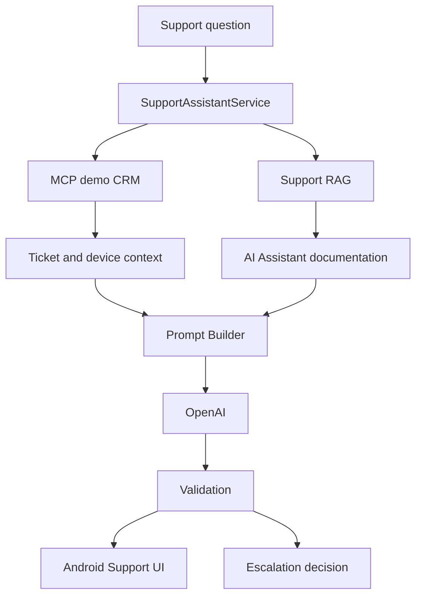

# AI Assistant

## Day 31 — Developer Assistant CLI

Добавлен отдельный Kotlin/JVM-инструмент `developer-assistant`: локальные embeddings и RAG-индекс строятся через Ollama `nomic-embed-text:latest`, ответ `/help` генерируется через OpenAI Responses API (`gpt-4.1-mini`), а Git-ветка получается через MCP. Инструмент не зависит от Android SDK и не входит в APK.

Запуск: `gradlew.bat :developer-assistant:run --args="--project-root=."`. Подробнее: [developer-assistant/README.md](developer-assistant/README.md).

## Day 29 — Local LLM Optimization

В режиме `Local` параметры Ollama меняются прямо в Settings и автоматически
применяются к следующему обычному или RAG-запросу: Model, Temperature,
Max output tokens, Context window, Top P, Repeat penalty, Seed и System prompt.

- Temperature управляет предсказуемостью и разнообразием.
- Max output tokens ограничивает длину ответа.
- Context window задаёт объём учитываемого контекста и расход памяти.
- Top P ограничивает набор вероятных токенов.
- Repeat penalty уменьшает повторы.
- Seed помогает повторять результаты.

Для сравнения качества фиксируйте seed и меняйте по одному параметру. Скорость
смотрите под локальным ответом в `tok/sec`; нажатие на метрики открывает детали
времени загрузки, генерации и количества токенов.

Установка и проверка моделей:

```bash
ollama pull qwen2.5:7b-instruct-q4_K_M
ollama pull qwen2.5:7b-instruct-q5_K_M
ollama list
ollama ps
ollama show qwen2.5:7b-instruct
```

Для эксперимента Q4_K_M и Q5_K_M отправляйте один и тот же prompt и сохраняйте
одинаковыми `temperature`, `max output tokens`, `context window`, `top_p` и
`repeat_penalty`. Q4_K_M обычно требует меньше памяти и работает быстрее;
Q5_K_M требует больше памяти и может дать более качественный результат, но это
не гарантируется и зависит от конкретного запроса.

Если выбранной модели нет, приложение не скачивает её автоматически: выполните
`ollama pull <model>` вручную.

> OpenRouter использует имена моделей вида `openai/gpt-4o-mini`, а прямой
> OpenAI API использует только имя модели без префикса, например `gpt-4.1-mini`.

Модульное Android-приложение на Kotlin и Jetpack Compose с двумя режимами LLM:

- `Online` — прямой OpenAI Responses API (`https://api.openai.com/v1/responses`);
- `Local` — Ollama (`http://10.0.2.2:11434`, модель по умолчанию `qwen2.5:7b-instruct`).

Приложение использует Clean Architecture, MVVM, Dagger 2, Retrofit/OkHttp, Room,
DataStore и локальный RAG. Один и тот же локальный retrieval-контекст передаётся
выбранному online или local генератору.

## Настройка OpenAI

1. Создайте API key в OpenAI Platform.
2. Подключите отдельный API billing (подписка ChatGPT не включает API billing).
3. Добавьте в корневой `local.properties` строку без кавычек:

```properties
OPENAI_API_KEY=your_openai_api_key
```

4. Синхронизируйте Gradle и пересоберите приложение.
5. В Settings выберите `Online`; при необходимости измените модель
   `gpt-4.1-mini`.
6. Выполните тестовый запрос.

`local.properties` не коммитится и указан в `.gitignore`. Если ключ отсутствует,
приложение покажет инструкцию и не отправит запрос с пустым Bearer-заголовком.

> Для учебного проекта ключ передаётся в `BuildConfig` и попадает в APK.
> Это нельзя использовать в опубликованном production-приложении.

## Локальный режим

Установите Ollama и загрузите модель:

```bash
ollama pull qwen2.5:7b-instruct
```

Android Emulator обращается к Ollama хоста по `http://10.0.2.2:11434`.
На физическом устройстве задайте IP компьютера в Settings.

## Проверка

Windows:

```powershell
.\gradlew.bat testDebugUnitTest
.\gradlew.bat assembleDebug
```

## Day 30 — Private LLM Service

The application has three independent backends: **OpenAI**, **Local Ollama**, and
**Private VPS**. The private path is:

`Android AI Assistant → HTTP API → Nginx → Open WebUI → Ollama → Qwen 2.5 3B`

Add development defaults to the untracked root `local.properties` file:

```properties
PRIVATE_VPS_BASE_URL=http://your-vps-ip/
PRIVATE_VPS_API_KEY=your-demo-user-api-key
PRIVATE_VPS_MODEL=qwen2.5:3b
```

These are only defaults. URL, model, and API key can be changed in Settings without
rebuilding. **Test VPS connection** calls `GET /api/models`; chat calls
`POST /api/chat/completions` with `stream=false`. RAG retrieval remains on Android and
the same retrieved context is sent to whichever backend is selected.

Use a key belonging to a dedicated non-admin demo user. `local.properties` is ignored
by Git, but BuildConfig defaults are embedded in the APK and can be extracted. The API
key override is stored locally on the device. Never use an administrator key.

Plain HTTP does not protect the Bearer token. Cleartext is allowed globally only in the
debug variant; release permits the emulator's existing `10.0.2.2` Ollama endpoint and
otherwise requires HTTPS. Configure HTTPS before production. Revoke the demo key after
recording the demo and create a new one.

HTTP 429 means the private service rate limit was exceeded. The app does not retry
automatically; retry manually later. `Retry-After` is shown when the server supplies it.

### Manual Day 30 check

1. Run the debug build and open Settings.
2. Select **Private VPS**, enter the URL, `qwen2.5:3b`, and demo-user API key.
3. Tap **Test VPS connection** and confirm the configured model is found.
4. Send a chat request and confirm the answer is labelled `VPS · qwen2.5:3b`.
5. Send requests quickly and verify readable HTTP 429 handling.
6. Switch to **Local Ollama** and **OpenAI** and test both.

Online и Local выбираются в Settings. Имя online-модели редактируется вручную;
локальные URL и модель настраиваются отдельно.
# Day 33 — AI Assistant User Support

Support Assistant встроен в текущее Android-приложение по маршруту **Settings → Support**. Он не добавляет аккаунты, авторизацию, подписки или платежи. Экран выбирает один из пяти демонстрационных тикетов, показывает безопасную карточку устройства, ведёт историю текущей support-сессии и выводит ответ, источники и рекомендацию оператора.



RAG читает только восемь Markdown-файлов из `support-knowledge/`: обзор продукта, FAQ, чат, историю, настройки, диагностику, коды ошибок и эскалацию. Для отдельного инкрементального индекса используются существующие chunker, Ollama embedding client и manifest storage:

```powershell
.\gradlew.bat :developer-assistant:run --args="index-support-knowledge --project-root=. --knowledge-root=support-knowledge"
```

Индекс сохраняется в `.support-assistant/index.json`, manifest — в `.support-assistant/manifest.json`; CRM JSON туда не входит. Android-пакет также включает scoped support-документы как assets и использует существующий `RagRetriever`.

Демонстрационная CRM находится в `mcp-server/data`: три вымышленных профиля и тикеты `ticket-101` (rate limit), `ticket-102` (нет сети), `ticket-103` (timeout), `ticket-104` (история), `ticket-105` (пустой ответ). Read-only MCP tools: `get_support_user`, `get_ticket`, `list_support_user_tickets`, `list_tickets`. Они возвращают структурированные ошибки и не изменяют тикеты или устройство.

Запуск:

```powershell
$env:MCP_PROJECT_ROOT = (Resolve-Path .).Path
$env:MCP_DISABLE_WEATHER = "true"
npm ci --prefix mcp-server
npm start --prefix mcp-server
.\gradlew.bat installDebug
```

Демо-вопросы: «Почему AI Assistant не отвечает?» для `ticket-101` и `ticket-102`, «Почему ответ генерируется так долго?» для `ticket-103`, «Почему исчез мой прошлый диалог?» для `ticket-104`. MCP имеет один ограниченный retry; при его недоступности ответ строится по общей документации. Недоступность/пустой результат RAG, повторные ошибки, неизвестная причина и потеря истории приводят к детерминированной рекомендации оператора. При недоступном OpenAI UI показывает контролируемую ошибку и повтор.

Проверка:

```powershell
npm test --prefix mcp-server
.\gradlew.bat :developer-assistant:test :core:domain:testDebugUnitTest assembleDebug test
git diff --check
```

Ограничения: CRM и диагностические коды демонстрационные; Support Assistant read-only и не связывается с реальным оператором; OpenAI/MCP/Ollama требуют доступной локальной конфигурации; восстановление удалённой локальной истории невозможно.
