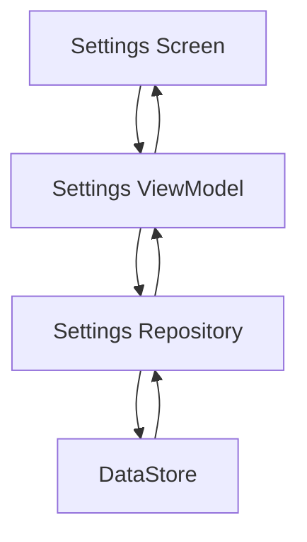

# 04_SettingsModule.md

# Settings Module

> Документ описывает модуль настроек Android AI Assistant.
>
> Используется как внутренняя документация проекта и как источник данных для RAG.

---

# Содержание

1. Назначение модуля
2. Архитектура
3. Какие настройки хранит приложение
4. Хранение настроек
5. Поток изменения настроек
6. UI
7. ViewModel
8. Repository
9. DataStore
10. Работа с API Key
11. Выбор модели
12. Тема приложения
13. Настройки AI
14. Подготовка к RAG
15. Будущее развитие
16. Best Practices

---

# 1. Назначение модуля

Settings Module отвечает за управление пользовательскими настройками приложения.

Этот модуль изолирован от Chat Module и предоставляет единый интерфейс доступа к конфигурации приложения.

Основные задачи:

- хранение пользовательских настроек;
- изменение модели LLM;
- управление API Key;
- выбор темы оформления;
- настройка параметров AI;
- хранение конфигурации будущего RAG;
- хранение настроек MCP.

---

# 2. Архитектура

```text
SettingsScreen
        │
        ▼
SettingsViewModel
        │
        ▼
SettingsRepository
        │
        ▼
DataStore
```

Модуль не зависит от Chat Module.

Chat Module только читает настройки.

---

# 3. Какие настройки хранит приложение

В приложении рекомендуется разделять настройки по категориям.

## AI

- выбранная модель;
- температура;
- max tokens;
- streaming;
- system prompt.

---

## Интерфейс

- светлая тема;
- темная тема;
- системная тема;
- размер шрифта.

---

## Сеть

- Base URL;
- timeout;
- proxy (если потребуется).

---

## RAG

В будущем:

- включить RAG;
- размер чанка;
- overlap;
- embedding model;
- количество найденных документов.

---

## MCP

- включить MCP;
- список серверов;
- разрешенные инструменты.

---

# 4. Модель настроек

Хорошей практикой является хранение всех настроек в одной модели.

```kotlin
data class AppSettings(

    val theme: ThemeMode,

    val model: String,

    val temperature: Float,

    val maxTokens: Int,

    val streamingEnabled: Boolean,

    val ragEnabled: Boolean

)
```

Это позволяет работать со всеми настройками как с единым объектом.

---

# 5. Почему DataStore

Для Android рекомендуется использовать DataStore вместо SharedPreferences.

Преимущества:

- асинхронность;
- Flow;
- типобезопасность;
- отсутствие блокировки UI;
- поддержка Coroutines.

---

# 6. Поток изменения настройки

Например пользователь выбирает другую модель.

```text
Settings Screen

↓

ViewModel

↓

Repository

↓

DataStore

↓

Flow<AppSettings>

↓

ViewModel

↓

Compose Recomposition
```

Изменения автоматически появляются на экране.

---

# 7. Settings Screen

Экран должен содержать только UI.

Например:

```text
AI Settings

Theme

Streaming

Model

Temperature

RAG

About
```

Не рекомендуется выполнять сохранение непосредственно из Compose.

---

# 8. Settings ViewModel

ViewModel управляет состоянием экрана.

Основные задачи:

- загрузка настроек;
- изменение настроек;
- сохранение;
- обработка ошибок.

Пример:

```kotlin
class SettingsViewModel(

    private val repository: SettingsRepository

) : ViewModel()
```

---

# 9. Repository

Repository скрывает реализацию хранения.

```kotlin
interface SettingsRepository {

    val settings: Flow<AppSettings>

    suspend fun setTheme(...)

    suspend fun setModel(...)

    suspend fun setStreaming(...)

}
```

UI ничего не знает про DataStore.

---

# 10. DataStore

Пример хранения:

```text
Preferences DataStore

theme

model

temperature

streaming

rag_enabled

api_key
```

Каждая настройка имеет собственный ключ.

---

# 11. Работа с API Key

API Key является чувствительной информацией.

Рекомендуется:

- не хранить в коде;
- не коммитить в Git;
- использовать Encrypted DataStore или Android Keystore;
- предоставить пользователю возможность изменить ключ.

Плохо:

```kotlin
const val API_KEY = "sk-xxxxxxxx"
```

Хорошо:

```text
Encrypted Storage

↓

Repository

↓

OpenAI Interceptor
```

---

# 12. Выбор модели

Приложение должно позволять менять модель.

Например:

```
GPT-4.1

GPT-4.1-mini

GPT-4.1

GPT-4.1-mini

Claude

Gemini

Ollama
```

В будущем можно добавить локальные модели.

---

# 13. Тема приложения

Compose позволяет использовать несколько режимов.

```text
System

Light

Dark
```

Настройка должна сохраняться между запусками приложения.

---

# 14. Настройки AI

Наиболее полезные параметры.

### Temperature

Определяет степень случайности ответа.

Маленькое значение:

```
0.2
```

Ответы более стабильные.

Большое:

```
1.0
```

Ответы становятся более разнообразными.

---

### Max Tokens

Максимальная длина ответа.

---

### Streaming

Позволяет получать ответ постепенно.

---

### System Prompt

Позволяет изменить поведение ассистента.

---

# 15. Подготовка к RAG

После внедрения RAG появятся новые настройки.

Например.

```text
Enable RAG

Chunk Size

Overlap

Embedding Model

Top K

Similarity Threshold
```

Эти параметры удобно хранить в отдельной модели.

```kotlin
data class RagSettings(

    val enabled: Boolean,

    val chunkSize: Int,

    val overlap: Int,

    val topK: Int

)
```

---

# 16. Настройки MCP

Появятся параметры:

- включить MCP;
- список серверов;
- таймаут;
- автоматически подтверждать вызов Tool;
- логировать Tool Calls.

---

# 17. Поток чтения настроек

```text
DataStore

↓

Repository

↓

Flow<AppSettings>

↓

ViewModel

↓

Compose UI
```

Таким образом UI автоматически реагирует на изменения.

---

# 18. Возможные улучшения

В будущем можно добавить:

- несколько AI-профилей;
- экспорт настроек;
- импорт настроек;
- резервное копирование;
- синхронизацию между устройствами.

---

# 19. Mermaid-схема



---

# 20. Best Practices

✅ Использовать DataStore.

✅ Не хранить API Key в коде.

✅ Все настройки объединить в AppSettings.

✅ Использовать Flow.

✅ Настройки изменять только через Repository.

✅ UI не должен знать о DataStore.

✅ ViewModel не должна работать с Preferences напрямую.

✅ Подготовить место для настроек RAG.

---

# FAQ

## Почему нельзя использовать SharedPreferences?

Потому что DataStore:

- безопаснее;
- современнее;
- работает с Coroutines;
- поддерживает Flow.

---

## Почему настройки находятся отдельно от Chat?

Чтобы Chat Module ничего не знал о способе хранения настроек.

---

## Почему Repository обязателен?

Repository позволяет в будущем заменить DataStore на базу данных или облачное хранилище без изменения UI.

---

# Заключение

Settings Module является центральным местом хранения конфигурации Android AI Assistant.

Изоляция настроек в отдельном модуле позволяет независимо развивать функциональность приложения, подключать новые AI-провайдеры, внедрять RAG и MCP, а также сохранять архитектуру чистой и масштабируемой.